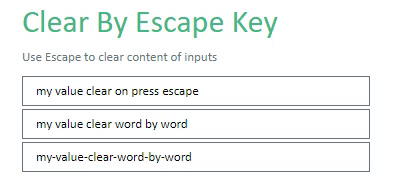
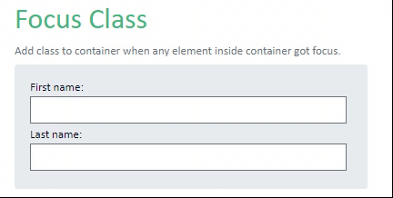
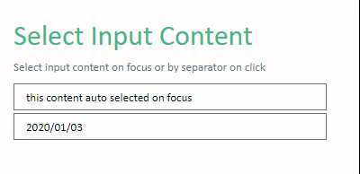

# Directives

Directive for vue 3.

## Installation

### CDN

this package published as `vDirective` module in umd.

```html
<script src="https://unpkg.com/@termehui/vdirective"></script>
```

### NPM

```bash
npm i @termehui/vdirective
```

## Usage

install all directives:

```ts
import { createApp } from "vue";
import App from "./App.vue";
import vDirective from "@termehui/vdirective";
createApp(App)
  .use(vDirective)
  .mount("#app");
```

import and install any directive you need:

```ts
import { createApp } from "vue";
import App from "./App.vue";
import { VAutoFocus, VClear, VFocusClass, VSelect } from "@termehui/vdirective";
createApp(App)
  .directive("focus", VAutoFocus)
  .directive("clear", VClear)
  .directive("focus-class", VFocusClass)
  .directive("select", VSelect)
  .mount("#app");
```

**Note**: all directive can added to parent element of input (useful for custom component).

```html
<!-- MyInput.Vue -->
<div class="input">
  <label>{{ title }}</label>
  <input type="text" />
</div>

<!-- App.Vue -->

<MyInput v-focus />
```

## Auto Focus

Focus element on element mounted.

```html
<form>
  <div>
    <label>First element:</label>
    <input type="text" />
  </div>
  <div>
    <label>Second element (auto focused):</label>
    <input type="text" v-focus />
  </div>
</form>
```

## Clear By Escape Key



Clear input content completely or by separator when press `Escape` key. You can pass separator character as directive parameter for clean sentences between separator.

```html
<input type="text" value="my value clear on press escape" v-clear />
<input type="text" value="my value clear word by word" v-clear="' '" />
<input
  type="text"
  value="The first sentence. The second sentence. The last sentence"
  v-clear="'.'"
/>
<input type="text" value="2021/12/01" v-clear="'/'" />
```

## Focus Class



Toggle class on element focus/blur. This directive can apply on container to fire on any element inside container got focus. You can pass class as directive parameter, by default this directive use `has-focus` class.

```html
<form>
  <div v-focus-class>
    <label>First name:</label>
    <input type="text" />
    <label>Last name:</label>
    <input type="text" />
  </div>

  <input type="text" v-focus-class="'is-focused'" />
</form>
```

## Select Input Content



Select input content on focus or by separator on click. You can pass separator character as directive parameter for select by separator.

```html
<input type="text" value="this content auto selected on focus" v-select />
<!-- Select date part on click -->
<input type="text" value="2020/01/03" v-select="'/'" />
```
